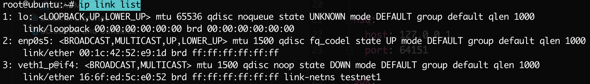

**创建一个网络命名空间 *ns1***

`ip netns add ns1`

创建好了之后, 已经可以查看其中的 **iptable**, **路由表**, **网络设备**等

`ip netns exec ns1 iptables -L`

**创建 *veth pairs***

`ip link add veth1 type veth peer name veth1_p`

*veth pairs* 对, 一个叫做 *veth1*, 一个叫做 *veth1_p*

**把一头添加给网络空间**

`ip link set veth1 netns ns1`

此时在母机查看设备可以看到 veth1_p 网卡设备, 而 veth1这个网卡已经在 ns1 中了

`ip link list`

`ip netns exec ns1 ip link list`

**给 *veth pairs* 配置 *IP* 并启动**

外部

`ip addr add 192.168.0.100/24 dev veth1_p`

`ip link set dev veth1_p up`

内部

`ip netns exec ns1 ip addr add 192.168.0.101/24 dev veth1`

`ip netns exec ns1 ip link set dev veth1 up`

至此已经可以 ping 通

`ip netns exec ns1 ping 192.168.0.100 -I veth1`

> 注: 所有的命令, 相反操作即可删除, up->down, add->del
